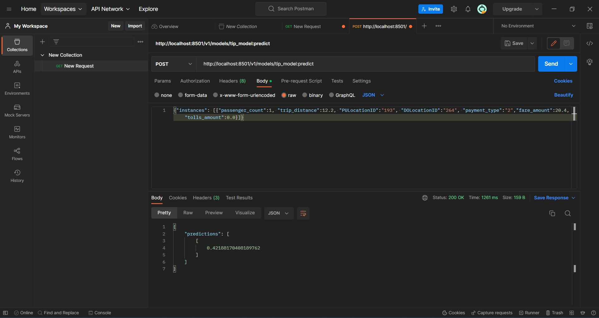

Model deployment

Steps :
# Git bash in week_3 directory 

# Activate earlier created python environment "zoomcamp"  :  conda activate zoomcamp 
* gcloud auth login
* bq --project_id optimum-airfoil-376815 extract -m trips_data_all.tip_model gs://dtc_data_lake_optimum-airfoil-376815/tip_model
* mkdir /tmp/model
* gsutil cp -r gs://dtc_data_lake_optimum-airfoil-376815/tip_model /tmp/model
* mkdir -p serving_dir/tip_model/1
* cp -r /tmp/model/tip_model/* serving_dir/tip_model/1
* docker pull tensorflow/serving
* docker run -p 8501:8501 --mount type=bind,source=`pwd`/serving_dir/tip_model,target=
  /models/tip_model -e MODEL_NAME=tip_model -t tensorflow/serving &

# Download postman app. Under Collections tab create new requests. Select "GET" tag with below link and click send. 
* http://localhost:8501/v1/models/tip_model
# Create another request with "POST" tag, inside body tag create raw json with below mentioned {"instances"...} and set  http://localhost:8501/v1/models/tip_model:predict and then click send toget predictions of this instance.

* curl -d '{"instances": [{"passenger_count":1, "trip_distance":12.2, "PULocationID":"193", "DOLocationID":"264", "payment_type":"2","fare_amount":20.4,"tolls_amount":0.0}]}' -X POST http://localhost:8501/v1/models/tip_model:predict
